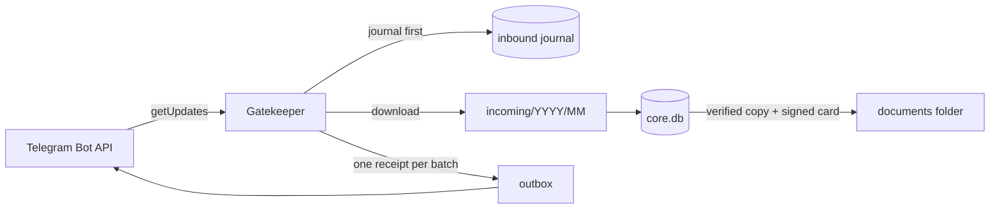

# Klepa

[](https://github.com/PaGrom/klepa/actions/workflows/ci.yml)
[](LICENSE)


Klepa is a family second-brain engine for AI agent hosts.

Family members send documents, photos and voice messages to a Telegram bot. Klepa keeps every original safe on the family's own Mac and files it into a shared or a personal space. In later stages it will let an agent host such as OpenClaw answer questions about those files, without ever holding the keys to the family's data.

> **Status: stage 1a.** Core receives files from Telegram and stores them durably. No agent host is connected yet. Run it only against a test bot and with test data.

## Principles

- **Originals are sacred.** Every file is written once and flushed to stable storage. The code never modifies or deletes an original.
- **Core owns the channel.** Core is the only process that polls the family bot. From stage 1c the agent host sees Telegram only through Core's gatekeeper, with a fake token.
- **Private where it matters.** A caption such as "just for me" puts a file, or a whole album, into the sender's personal space.
- **Nothing leaves by accident.** There is no telemetry. Secrets live in 0600 files and never reach databases, logs or error messages.
- **Crash-safe.** Every update is journaled before Telegram is told it arrived. After a restart Core picks up where it stopped, without duplicates.

## How it works



1. **Journal first.** The gatekeeper long-polls the family bot and writes each batch of updates to the inbound journal before the next poll acknowledges it.
2. **Filtering.** Only messages from configured family members in a private chat are accepted. Everything else is dropped and logged without its text.
3. **Storing.** Attachments are downloaded, written to `incoming/` and recorded in `core.db`.
4. **Receipts.** Core answers once per batch ("📄 got 3 files") in the configured language.
5. **Copies.** Each original is copied into the documents folder next to an HMAC-signed provenance card, and the copy is verified by SHA-256.

See [docs/architecture.md](docs/architecture.md) for the full design and the roadmap.

## Quick start

You need macOS (Linux works for development), Python 3.13 and [uv](https://docs.astral.sh/uv/).

```bash
git clone https://github.com/PaGrom/klepa.git
cd klepa
uv sync
```

Run Klepa against a **separate test bot**, never against a bot that is already in use: two pollers on one token make Telegram answer 409 to both.

1. Create a bot with [@BotFather](https://t.me/BotFather) and turn off `/setjoingroups` for it.
2. Copy [`config/example.toml`](config/example.toml) outside the repository, for example to `~/KlepaData-test/config.toml`. Fill it in using [docs/configuration.md](docs/configuration.md).
3. Put the token into its file without echo and without shell history:

   ```bash
   mkdir -p ~/KlepaData-test/keys && chmod 700 ~/KlepaData-test ~/KlepaData-test/keys
   umask 077; read -rs TOKEN; printf %s "$TOKEN" > ~/KlepaData-test/keys/family-bot.token; unset TOKEN
   ```

4. Initialize and run Core in the foreground:

   ```bash
   uv run python -m klepa_core init --config ~/KlepaData-test/config.toml
   uv run python -m klepa_core run --config ~/KlepaData-test/config.toml
   ```

5. Send the bot a PDF, an album or a voice message.
6. Stop Core with Ctrl-C. It sends pending receipts before it exits.

## Development

```bash
uv sync
uv run pytest          # unit and acceptance tests against a fake Telegram
uv run ruff check      # lint
uv run ruff format     # format
uv run mypy            # strict type check
```

See [CONTRIBUTING.md](CONTRIBUTING.md) for the workflow and the rules.

## Roadmap

| Stage | Scope | Status |
|---|---|---|
| 1a | Core receives files from Telegram and stores them durably | done |
| 1b | Service bot, signed daily snapshots, Core as a launchd service | planned |
| 1c | OpenClaw behind the gatekeeper: egress proxy, host interface, supervision | planned |
| 2 | Processing: transcription and OCR in a sandbox, photo drafts to PDF, page viewer | planned |
| 3 | Knowledge: facts with verified quotes, `make_private`, disclosure journal | planned |
| 4 | Reminders and self-checks, fenced outbound delivery | planned |
| 5 | Workflows the family teaches by example | planned |
| 6–11 | Migration, maintenance agent, setup dialog, metrics, Hermes, code generation | planned |

Stages 1–5 must pass their acceptance scenarios before any real family data is migrated.

## Security

Please report vulnerabilities privately. See [SECURITY.md](SECURITY.md).

## License

[MIT](LICENSE) © The Klepa contributors
