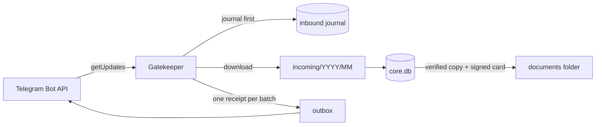

# Klepa

[](https://github.com/PaGrom/klepa/actions/workflows/ci.yml)
[](LICENSE)


Klepa is a family second-brain engine for AI agent hosts.

Family members send documents, photos and voice messages to a Telegram bot. Klepa keeps every original safe on the family's own Mac and files it into a shared or a personal space. In later stages it will let an agent host such as OpenClaw answer questions about those files, without ever holding the keys to the family's data.

> **Status: stage 1c.** Core receives files from Telegram and stores them durably, runs as a launchd service, takes signed daily snapshots and reports to the owner through a service bot. OpenClaw runs behind the gatekeeper: Core installs its own pinned OpenClaw, starts it under launchd and checks it with a live probe before it gets messages. In stage 1 Core still answers people itself. Run it only against test bots and with test data.

## Principles

- **Originals are sacred.** Every file is written once and flushed to stable storage. The code never modifies or deletes an original.
- **Core owns the channel.** Core is the only process that polls the family bot. From stage 1c the agent host sees Telegram only through Core's gatekeeper, with a fake token.
- **Private where it matters.** A caption such as "just for me" puts a file, or a whole album, into the sender's personal space.
- **Nothing leaves by accident.** There is no telemetry. Secrets live in 0600 files and never reach databases, logs or error messages.
- **Crash-safe.** Every update is journaled before Telegram is told it arrived. After a restart Core picks up where it stopped, without duplicates.

## How it works



1. **Journal first.** The gatekeeper long-polls the family bot and writes each batch of updates to the inbound journal before the next poll acknowledges it.
2. **Filtering.** Only messages from configured family members in a private chat are accepted. Everything else is dropped and logged without its text.
3. **Storing.** Attachments are downloaded, written to `incoming/` and recorded in `core.db`.
4. **Receipts.** Core answers once per batch ("📄 got 3 files") in the configured language.
5. **Copies.** Each original is copied into the documents folder next to an HMAC-signed provenance card, and the copy is verified by SHA-256.

See [docs/architecture.md](docs/architecture.md) for the full design and the roadmap.

## Quick start

You need macOS (Linux works for development), Python 3.13 and [uv](https://docs.astral.sh/uv/).

```bash
git clone https://github.com/PaGrom/klepa.git
cd klepa
uv sync
```

Run Klepa against a **separate test bot**, never against a bot that is already in use: two pollers on one token make Telegram answer 409 to both.

1. Create a bot with [@BotFather](https://t.me/BotFather) and turn off `/setjoingroups` for it.
2. Copy [`config/example.toml`](config/example.toml) outside the repository, for example to `~/KlepaData-test/config.toml`. Fill it in using [docs/configuration.md](docs/configuration.md).
3. Put the token into its file without echo and without shell history:

   ```bash
   mkdir -p ~/KlepaData-test/keys && chmod 700 ~/KlepaData-test ~/KlepaData-test/keys
   umask 077; read -rs TOKEN; printf %s "$TOKEN" > ~/KlepaData-test/keys/family-bot.token; unset TOKEN
   ```

4. Initialize and run Core in the foreground:

   ```bash
   uv run python -m klepa_core init --config ~/KlepaData-test/config.toml
   uv run python -m klepa_core run --config ~/KlepaData-test/config.toml
   ```

5. Send the bot a PDF, an album or a voice message.
6. Stop Core with Ctrl-C. It sends pending receipts before it exits.

## Running as a service

Core can run under launchd, report to the owner through a second bot and take a signed snapshot every night.
Core must not run in the foreground at the same time: the service holds the data directory's lock.

1. **Service bot.** Create a second bot with [@BotFather](https://t.me/BotFather), turn off `/setjoingroups`, and put its
   token into `~/KlepaData-test/keys/service-bot.token` the same way as the family bot's token. Add a `[service_bot]`
   section to the config (see [`config/example.toml`](config/example.toml)).
2. **Bind it to the owner.** With Core stopped, run
   `uv run python -m klepa_core service-bot bind --config ~/KlepaData-test/config.toml`, open the printed link from
   the owner's own Telegram account and confirm in the terminal.
3. **Give Core its own interpreter**, so that the macOS permission for the documents folder belongs to Core alone:

   ```bash
   KLEPA_HOME="$HOME/Library/Application Support/Klepa"
   UV_PYTHON_INSTALL_DIR="$KLEPA_HOME/python" uv python install 3.13
   uv venv --python "$(UV_PYTHON_INSTALL_DIR="$KLEPA_HOME/python" uv python find --python-preference only-managed 3.13)" "$KLEPA_HOME/venv"
   uv pip install --python "$KLEPA_HOME/venv/bin/python" .
   ```

4. **Install the service:**
   `"$KLEPA_HOME/venv/bin/python" -m klepa_core service install --config ~/KlepaData-test/config.toml`.
   It checks the tokens and the interpreter first, and excludes `keys/` from Time Machine.
5. **Allow the documents folder.** If macOS asks whether Python may open the documents folder, allow it. If the
   service bot reports that macOS denies access, allow the interpreter it names in System Settings → Privacy &
   Security → Full Disk Access. Then restart Core: `"$KLEPA_HOME/venv/bin/python" -m klepa_core service restart`.
   A new interpreter (after a Python upgrade) needs the permission again.
6. **Keep a paper copy of the signing key.** In your own terminal run
   `"$KLEPA_HOME/venv/bin/python" -m klepa_core keys paper-backup --config ~/KlepaData-test/config.toml`, write the
   lines on paper and clear the terminal. `keys restore` types them back in.
7. **Check it.** Press Status in the service bot. The daily line comes at 09:00; a missing line means trouble.
   `service status` shows whether launchd runs Core; `service uninstall` stops it for good.

## Running the agent host

Core runs its own OpenClaw gateway, apart from any other OpenClaw on the Mac. It needs Core running as a service.

1. **Configure it.** Add a `[host]` section with `egress_allow = ["api.anthropic.com:443"]`
   ([configuration](docs/configuration.md#host)).
2. **Install the runtime:** `"$KLEPA_HOME/venv/bin/python" -m klepa_core host install --config ~/KlepaData-test/config.toml`.
   It downloads a pinned Node from nodejs.org (about 27 MB, checked against its SHA-256) and OpenClaw from npm with a
   pinned lockfile (about 540 MB), then writes the gateway's config, which OpenClaw itself may not change.
3. **Give it the model.** In your own terminal run `claude setup-token`, then
   `"$KLEPA_HOME/venv/bin/python" -m klepa_core host login --config ~/KlepaData-test/config.toml` and paste the token
   when it asks; it is not shown. Never paste it into a chat. Run `host login` again to replace the token; a running
   gateway takes the new one at once.
4. **Restart Core:** `"$KLEPA_HOME/venv/bin/python" -m klepa_core service restart`. Core starts the gateway, checks it,
   and only then gives it messages. `host status` shows the runtime, the gateway, the model's token and Core's view.

## Development

```bash
uv sync
uv run pytest          # unit and acceptance tests against a fake Telegram
uv run ruff check      # lint
uv run ruff format     # format
uv run mypy            # strict type check
cd tests/adapter && npm ci --ignore-scripts && npx tsc -p tsconfig.json && node --test adapter.test.ts
```

The tests against the real gateway run only where `KLEPA_TEST_RUNTIME` names an installed runtime, for example
`KLEPA_TEST_RUNTIME="$HOME/Library/Application Support/Klepa/openclaw" uv run pytest tests/test_gateway_live.py`.

See [CONTRIBUTING.md](CONTRIBUTING.md) for the workflow and the rules.

## Roadmap

| Stage | Scope | Status |
|---|---|---|
| 1a | Core receives files from Telegram and stores them durably | done |
| 1b | Service bot, signed daily snapshots, Core as a launchd service | done |
| 1c | OpenClaw behind the gatekeeper: its own install, reference config, adapter plugin, egress proxy, supervision | done |
| 2 | Processing: transcription and OCR in a sandbox, photo drafts to PDF, page viewer | planned |
| 3 | Knowledge: facts with verified quotes, `make_private`, disclosure journal | planned |
| 4 | Reminders and self-checks, fenced outbound delivery | planned |
| 5 | Workflows the family teaches by example | planned |
| 6–11 | Migration, maintenance agent, setup dialog, metrics, Hermes, code generation | planned |

Stages 1–5 must pass their acceptance scenarios before any real family data is migrated.

## Security

Please report vulnerabilities privately. See [SECURITY.md](SECURITY.md).

## License

[MIT](LICENSE) © The Klepa contributors
